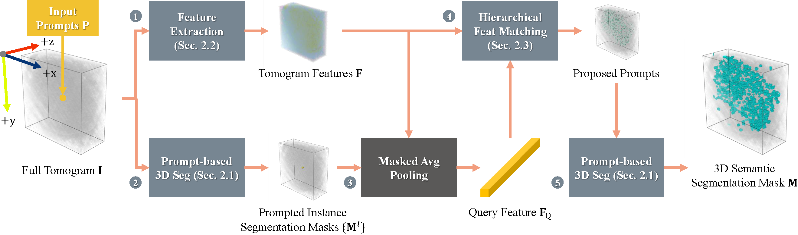

# Training-free CryoET Tomogram Segmentation



> [**Training-free CryoET Tomogram Segmentation**](https://www.arxiv.org/abs/2407.06833),  
> Yizhou Zhao, Hengwei Bian, Michael Mu, Mostofa Rafid Uddin, Zhenyang Li, Xiang Li, Tianyang Wang, Min Xu,  
> MICCAI 2024

## Installation

We tested our code using:

- CentOS 7
- CUDA 11.8
- 1 x Nvidia A100 80G

To install the environment:

```shell
conda create -n cryosam python=3.10 -y
conda activate cryosam
conda install pytorch==2.2.0 torchvision==0.17.0 pytorch-cuda=11.8 -c pytorch -c nvidia -y
pip install einops matplotlib mrcfile pandas tqdm
pip install git+https://github.com/facebookresearch/segment-anything.git
```

## Data Preparation

We use [Warp](http://www.warpem.com/warp/) to reconstruct and denoise the tomogram before running CryoSAM.

## Getting Started

First download SAM [checkpoint](https://dl.fbaipublicfiles.com/segment_anything/sam_vit_h_4b8939.pth) to `model/`, then the model can be used in just a few lines to get masks from given prompts:

```python
import numpy as np
from cryosam.model import CryoSAM

model = CryoSAM()
# voxel: tomogram of shape (D, H, W)
# input_prompts: point prompts of shape (N, 3)
output = model.infer(voxel, input_prompts)
```

## Citing CryoSAM

If you find this project helpful for your research, please consider citing the following BibTeX entry.

```
@article{zhao2024training,
  title={Training-free CryoET Tomogram Segmentation},
  author={Zhao, Yizhou and Bian, Hengwei and Mu, Michael and Uddin, Mostofa R and Li, Zhenyang and Li, Xiang and Wang, Tianyang and Xu, Min},
  journal={arXiv preprint arXiv:2407.06833},
  year={2024}
}
```